# Dom Manipulation Assignment

1. Webiste Name: [Dev To](https://dev.to/)

### Topics

    - Query Selctory, Inner HTML

### Sample Image


### Tasks

        Target the Top description div and change the DEV Community to <Your_Name> and description to your passion

### Sample Output


### My Response:           

**My Code :**
```javascript
document.querySelector(".side-bar .crayons-card .crayons-subtitle-2").innerHTML = `
    <a href="https://github.com/sidp919" class="c-link c-link--branded">Sidharth Pandey</a>
`;
document.querySelector(".side-bar .crayons-card .color-base-70").innerText = "I am aspiring to become a full-stack web developer";
```
**My Output :**


#

2. Website Name: [Apple](https://support.apple.com/en-in)

### Task


### Fetch all the product name and store in an array

### Sample Output

['iPhone', 'Mac', 'iPad', 'Watch', 'AirPods', 'Music', 'TV']

### My Response:           

**My Code :**

```javascript
let productsArr = document.querySelectorAll(".as-imagegrid-item-title");
let products = [];
for(let product of productsArr){
    let item = product.innerText.substring(0,product.innerText.indexOf("\n"));
    products.push(item);
}
console.log(products);
```

**My Output :**

['iPhone', 'Mac', 'iPad', 'Watch', 'AirPods', 'Music', 'TV']

#

3. Webiste Name: [Youtube Support](https://support.google.com/youtube/)

### Topics

    - Get Element By Id, Create Element, Create Text Node, Append Child

### Sample Image


### Tasks

     Add another FAQ 'My New FAQ' to the list

### Sample Output


### My Response:           

**My Code :**

```javascript
let nav = document.querySelector("nav");
let newFaq = 
`
    <section class="parent" data-id="9257498" data-stats-idx="1,8"><h3 role="button" tabindex="0" aria-expanded="false" aria-label="Fix a problem">Sid added a FAQ<svg class="up" viewBox="0 0 24 24"><path d="M7.41 15.41L12 10.83l4.59 4.58L18 14l-6-6-6 6z"></path></svg><svg class="down" viewBox="0 0 24 24"><path d="M7.41 7.84L12 12.42l4.59-4.58L18 9.25l-6 6-6-6z"></path></svg></h3><div class="overflow"><div class="children" role="list" aria-hidden="true" style="margin-top: -170px; display: none;"><div class="child" role="listitem"><a class="topic-link" href="/youtube/topic/9257404?hl=en&amp;ref_topic=9257498">Troubleshoot problems playing videos</a></div><div class="child" role="listitem"><a class="topic-link" href="/youtube/topic/3024171?hl=en&amp;ref_topic=9257498">Troubleshoot account issues</a></div><div class="child" role="listitem"><a class="topic-link" href="/youtube/topic/2888603?hl=en&amp;ref_topic=9257498">Fix upload problems</a></div><div class="child" role="listitem"><a class="topic-link" href="/youtube/topic/9257117?hl=en&amp;ref_topic=9257498">Fix YouTube Premium membership issues</a></div><div class="child" role="listitem"><a class="topic-link" href="/youtube/topic/9153641?hl=en&amp;ref_topic=9257498">Get help with the YouTube Partner Program</a></div></div></div></section>
`;
nav.innerHTML = nav.innerHTML + newFaq;
```

**My Output :**

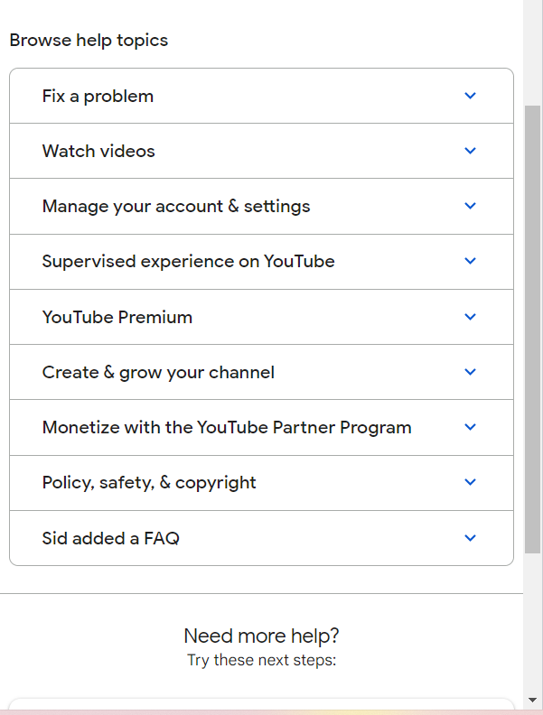

#

4. Webiste Name: [OnePlus](https://www.oneplus.in/support)

### Topics

     Query Selector, InnerText

### Sample Image


### Tasks

      Change the contact number

### Sample Output


### My Response:           

**My Code :**

```javascript
let phoneElement = document.querySelector(".contact-us .customer-support .one-tel-number");
phoneElement.innerText = '+91 9090909090';
phoneElement.setAttribute("href","tel:+91 9090909090");
```
**My Output :**

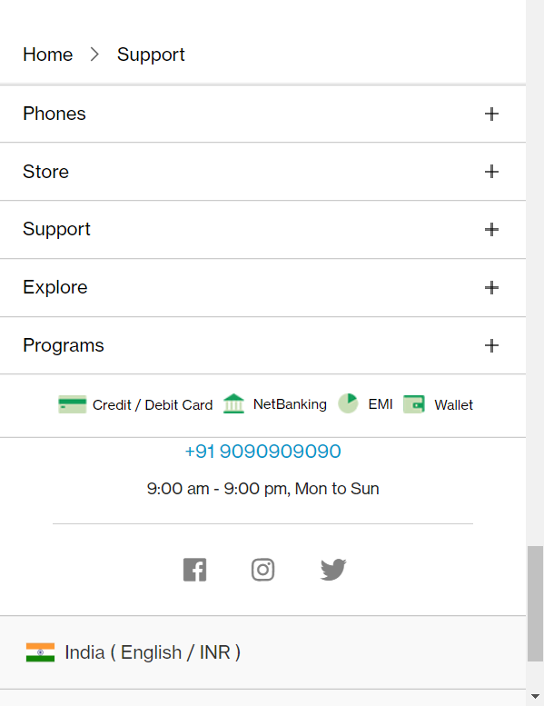

#

5. Webiste Name: [Samsung](https://www.samsung.com/in/offer/online/samsung-fest/)

### Topics

       getElementById, createElement, InnerText, append, setAttribute

### Sample Image


### Tasks

     Target the main div of card and change the Button text to Check out

### Sample Output


### My Response:           

**My Code :**

```javascript
let cardElement = document.querySelectorAll(".mytabs .diwali-deals-product-sale-pro .diwali-deals-product-sale-btn");
cardElement.forEach((card) => {
    card.innerText = "Check out"
});
```

**My Output :**

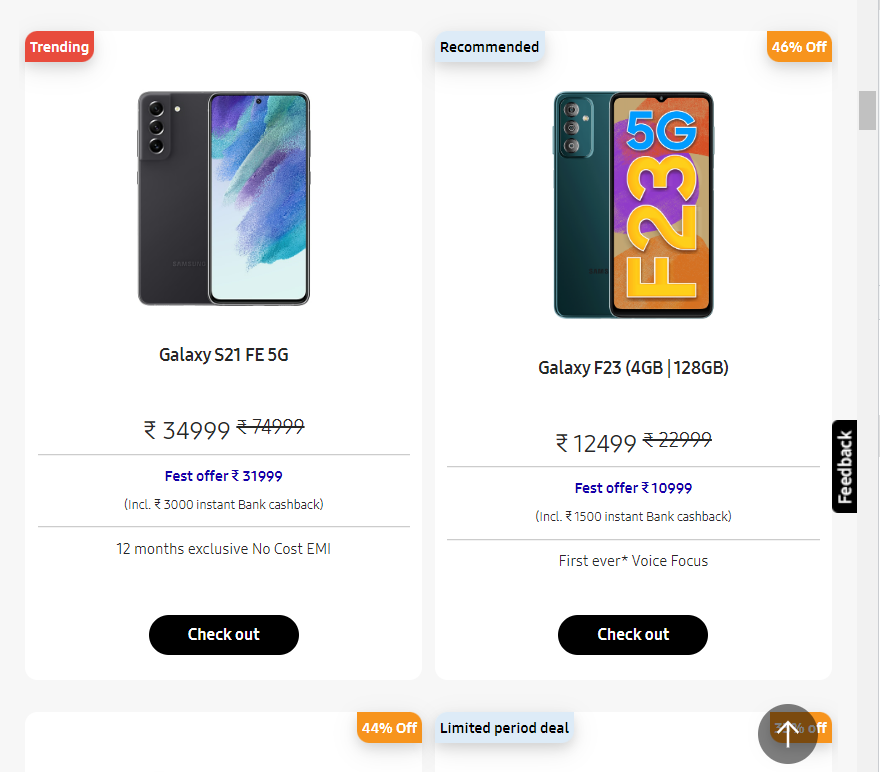

#

6. Webiste Name: [Adidas](https://www.adidas.co.in/)

### Topics

    -   Query Selector, Event listeners, Changing Styles

### Sample Image


### Tasks

     Target the search box and on hover change thebackground color to red.

### Sample Output


### My Response:           

**My Code :**

```javascript
let inputElement = document.querySelector(".searchinput___19uW0");
inputElement.addEventListener("mouseover",bgRedOnHover);
function bgRedOnHover(event){
    event.target.style.backgroundColor = "#ff0000";
}
inputElement.addEventListener("mouseout",bgGreyDefault);
function bgGreyDefault(event){
    event.target.style.backgroundColor = "#eceff1";
}
```

**My Output :**

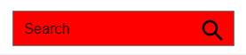

#

7. Webiste Name: [MDN Web Docs](https://developer.mozilla.org/en-US/)

### Topics

       Form, Value, Submit

### Sample Image


### Tasks

     To Search a topic in the MDN Search bar.
     First add a text to search in the search bar and then hit the submit search button to search the docs using DOM

### Sample Output


### My Response:           

**My Code :**

```javascript
let searchQuery = "SubmitEvent"; //keyword/text to be searched
let searchForm = document.querySelector("#top-nav-search-form");
let searchBox = searchForm.querySelector("#top-nav-search-input");
searchBox.value = searchQuery;
searchForm.submit();
```
**My Output :**


#

8. Webiste Name: [Google](https://www.google.com/)

### Topics

       Remove Elements

### Sample Image


### Tasks

     Remove alternate languages from the home page languages listed

### Sample Output


### My Response:           

**My Code :**

```javascript
let langDiv = document.querySelector("#SIvCob");
let langNodeList = langDiv.querySelectorAll("a");
let noOfLang = langNodeList.length;
for(let i = 0; i < noOfLang;){
    langDiv.removeChild(langNodeList[i]);
    i = i + 2;
}
```

**My Output :**

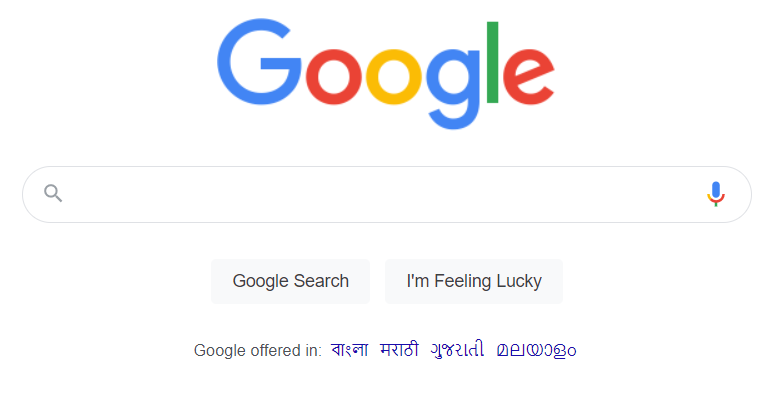

#

9. Webiste Name: [Code Wars](https://www.codewars.com/)

### Topics

       Change Font Family, Color of Text.

### Sample Image


### Tasks

    Change the font family of the text to monospace and text color to the logo’s background color.

### Sample Output


### My Response:           

**My Code :**

```javascript
let h1Element = document.querySelector(".wf-section .container .content-width-extra-large .display-heading-1");
h1Element.style.color = "#b1361e";
h1Element.style.fontFamily = "monospace";
```

**My Output :**

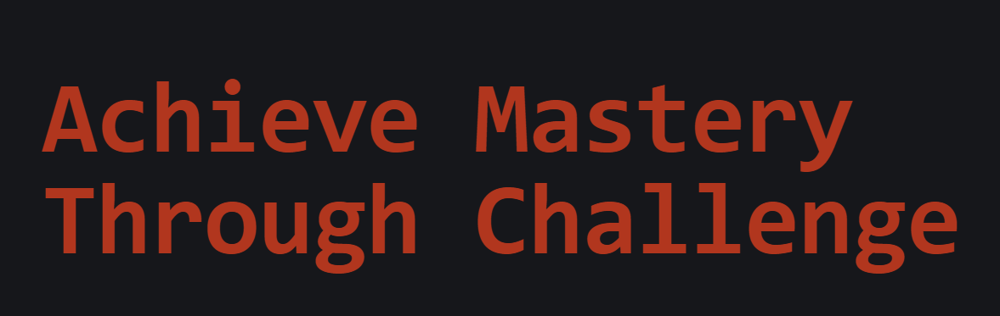

#

10. Webiste Name: [Freecodecamp](https://www.freecodecamp.org/)

### Topics

       querySelector, mouseover, click eventListener,  callback function, style,

### Sample Image


### Tasks

    Target the button and change background colour on mouseover

### Sample Output


### My Response:           

**My Code :**

```javascript
let getStartElement = document.querySelector(".btn-cta-big .login-btn-text");
getStartElement.addEventListener("mouseover", redBgOnHover);
getStartElement.addEventListener("mouseout", defaultBg);
function redBgOnHover(evt){
    evt.target.style.backgroundColor = "#ff0000";
}
function defaultBg(evt){
    evt.target.style.backgroundColor = "";
}
```

**My Output :**

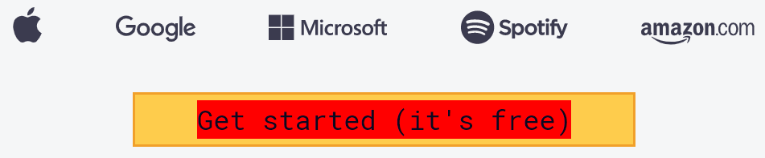

#

11. Webiste Name: [realme](https://www.realme.com/in/)

### Topics

       querySelector,style,background-image

### Sample Image


### Tasks

    change the realme logo to ineuron logo

### Sample Output


### My Response:           

**My Code :**

```javascript
let logoElement = document.querySelector(".icon-logo");
logoElement.style.backgroundImage = "url('https://ineuron.ai/images/ineuron-logo.png')";
```

**My Output :**


#

12. Webiste Name: [Github](https://github.com/)

### Topics

       querySelector,style,background-Color

### Sample Image


### Tasks

     change the background colour of the button to blue.

### Sample Output


### My Response:           

**My Code :**

```javascript
let newRepoBtn = document.querySelector("div section div a.btn-primary");
newRepoBtn.style.backgroundColor = "#0000ff";
```

**My Output :**

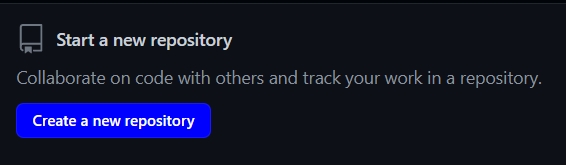

#

13. Webiste Name: [Hackerrank](https://www.hackerrank.com/)

### Topics

       querySelector,innerHtml

### Sample Image


### Tasks

Target the top description and change “Matching developers with great companies” to ‘JSBOOTCAMP“.

### Sample Output


### My Response:           

**My Code :**

```javascript
let headingElement = document.querySelector(".fl-node-content .fl-module-heading .fl-module-content .fl-heading .fl-heading-text");
headingElement.innerText = "JSBOOTCAMP";
```

**My Output :**

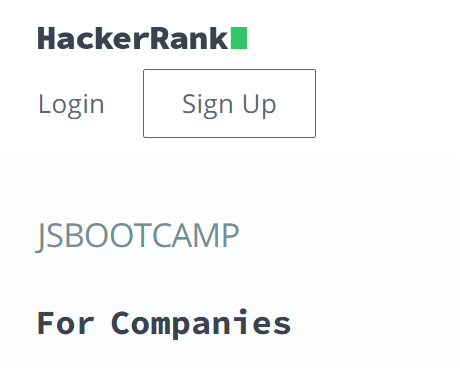

#

14. Webiste Name: [Asus](https://www.asus.com/in/)

### Topics

      querySelector,style,font-size

### Sample Image


### Tasks

       change the fontsize of “Hot Deals” to 80px

### Sample Output


### My Response:           

**My Code :**

```javascript
let hotElement = document.querySelector(".HotDealsAll__Heading__2fIbe");
hotElement.style.fontSize = "80px";
```
**My Output :**

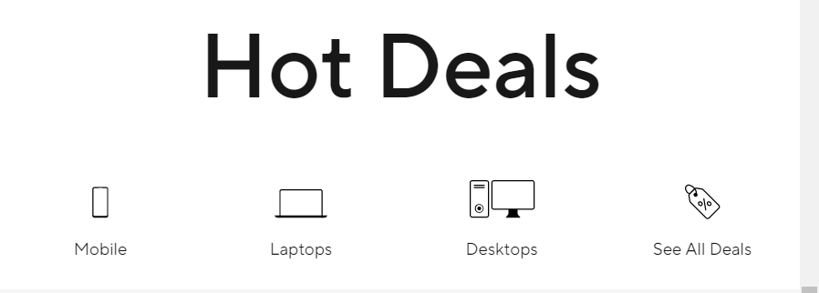

#

15. Webiste Name: [Dell](https://www.dell.com/en-in/shop/deals/laptop-deals?gacd=10415953-9016-5761040-285981356-0&dgc=ST&gclid=Cj0KCQjwguGYBhDRARIsAHgRm4-XUDMhhVNyHXb3s1gY4ZBzORr_d9Se-buhJwy7asyUe7YdqEA11eEaAt6UEALw_wcB&gclsrc=aw.ds&nclid=BxjBlpBQsX6pjSHh-L8YYSU77EpfXRkG1AGMB5Wbeu386ykspfrPDnfx_DdFau20)

### Topics

      querySelector,style.textAlign

### Sample Image


### Tasks

       Convert the text “G15 Gaming Laptop” from left to right

### Sample Output


### My Response:           

**My Code :**

```javascript
let headingElement = document.querySelector("#d560824win9b .ps-top .ps-title");
headingElement.style.textAlign = "right";
```

**My Output :**


#

16. Webiste Name: [Vercel](https://vercel.com/)

### Topics

     querySelector,innerHTMl

### Sample Image


### Tasks

      change the heading “Start with the developer” to “Start with Scratch”

### Sample Output


### My Response:           

**My Code :**

```javascript
let headingElement = document.querySelector(".section-title_title__VEDfK");
headingElement.innerText = "Start with Scratch";
```
**My Output :**

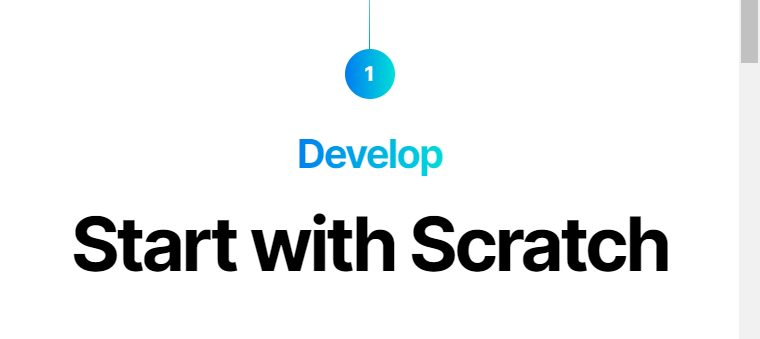

#

17. Webiste Name: [Sony](https://www.sony.co.in/)

### Topics

    querySelector,innerHTMl

### Sample Image


### Tasks

     change the button text To current Date.

### Sample Output


### My Response:           

**My Code :**

```javascript
let date = new Date();
let dateStr = date.toString();
let btnElement = document.querySelector(".span4 .mlp-container .mlp-inner .mlp-collapse-content .btn-container");
btnElement.innerHTML = dateStr;
```

**My Output :**

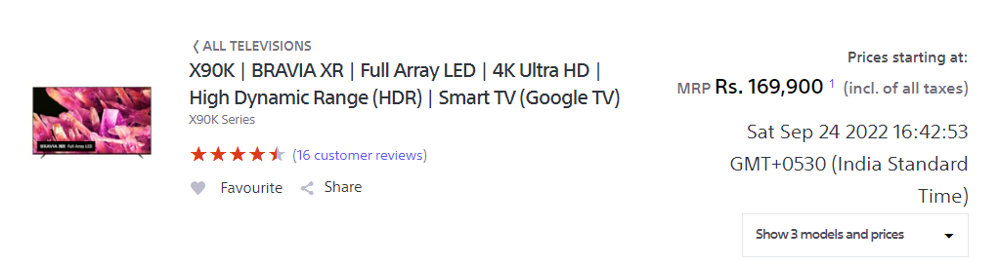

#

18. Webiste Name: [Philips](https://www.philips.co.in/)

### Topics

     querySelector,style,backgroundcolor

### Sample Image


### Tasks

    change the background colour blue to orange

### Sample Output


### My Response:           

**My Code :**

```javascript
let footSec01Element = document.querySelector(".p-f03-footer-container .p-footer");
footSec01Element.style.backgroundColor = "#FFA500";
```

**My Output :**

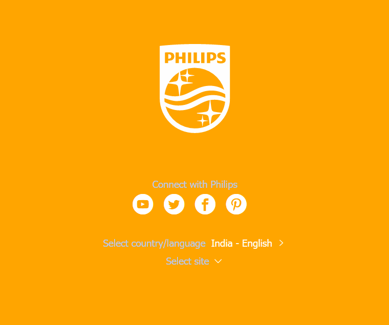

#

19. Webiste Name: [Canon](https://in.canon/)

### Topics

          querySelector,src

### Sample Image


### Tasks

    extract the image link of canon logo

### Sample Output


### My Response:           

**My Code :**

```javascript
let logoElement = document.querySelector(".navbar-brand .logo");
let logoSrc = logoElement.getAttribute("src");
let currPageURL = window.location.href;
let logoURL = currPageURL + logoSrc.substring(1);
console.log(logoURL);
```

**My Output :**

https://in.canon/assets/brand/logo-300-002e45a4aec98fd92899838da9d5560f.png

#

20. Webiste Name: [Oppo](https://www.oppo.com/in/)

### Topics

          querySelector,style,color

### Sample Image


### Tasks

      Change the description colour black to orange

### Sample Output


### My Response:           

**My Code :**

```javascript
let prodDescElement = document.querySelector(".index__three-products-1-mb .section-box .desc");
prodDescElement.style.color = "#FFA500";
```

**My Output :**


#
